# Studbud -- cche8505 Chun-Han CHEN

# Background
Studbud is a web application for student manage their study sessions.

# Function
* Music Player
* Timer and Pomodoro
* Calandar
* Reading List
* Task List

# Devices
The web prototype is suitable for iPhoneX(375 ✖️ 812) and Laptop(1400 ✖️ 800).

# User feedback -- Mockup -- Iteration
### Timer and Pomodoro
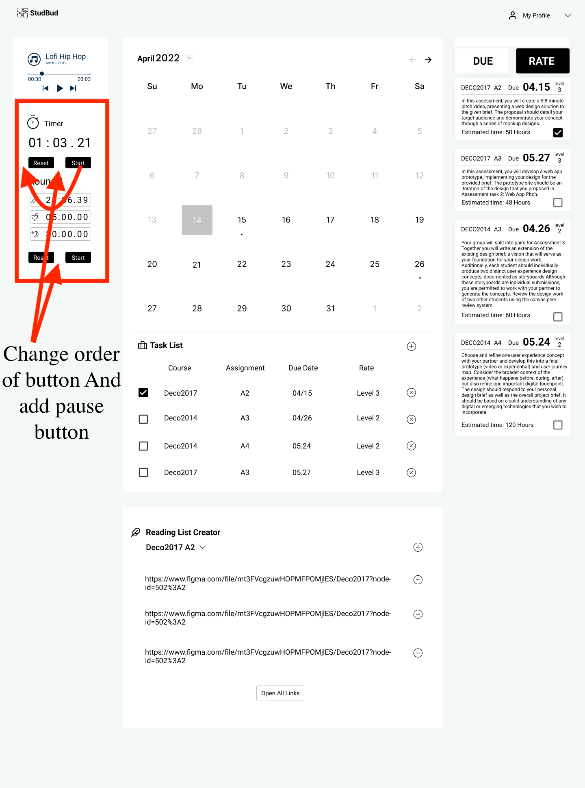
* Add Pause button
* Change the order of button

Reset button normally in the last.
  

### Calendar
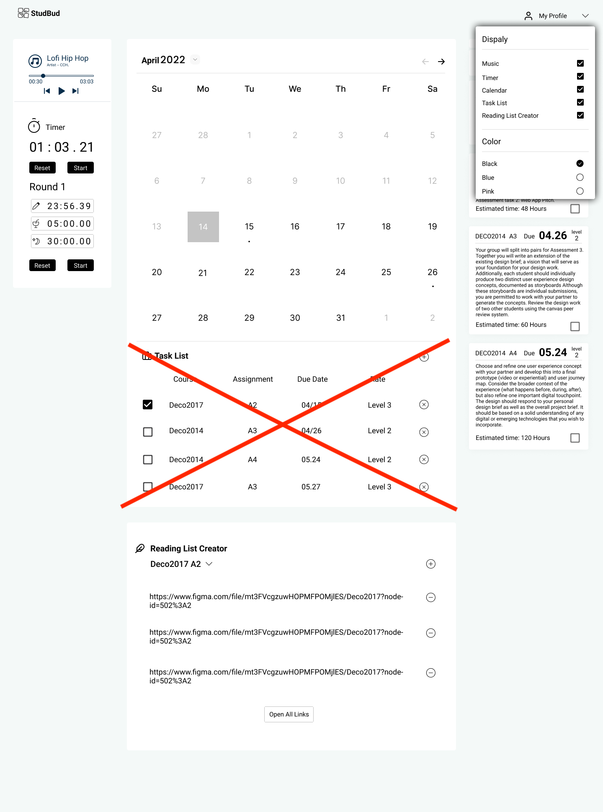
* Delete the task list which in the calendar.

Duplicate two task list may confuse the user's attention. So I remove one of them.
  

### Reading list
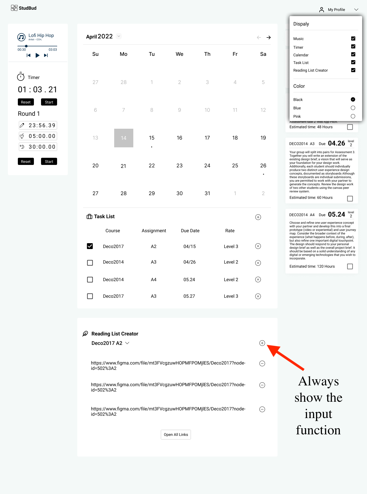
* Keep adding functions on the homepage, because adding reading only requires a connection, which will be more convenient for users.
  

### Task list
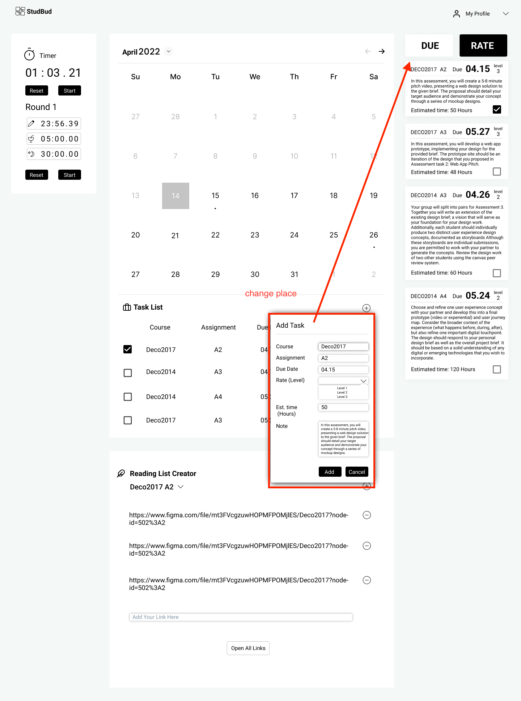
* Because I remove one of the task list, so I need to change the place of the add task function.
  

### Setting
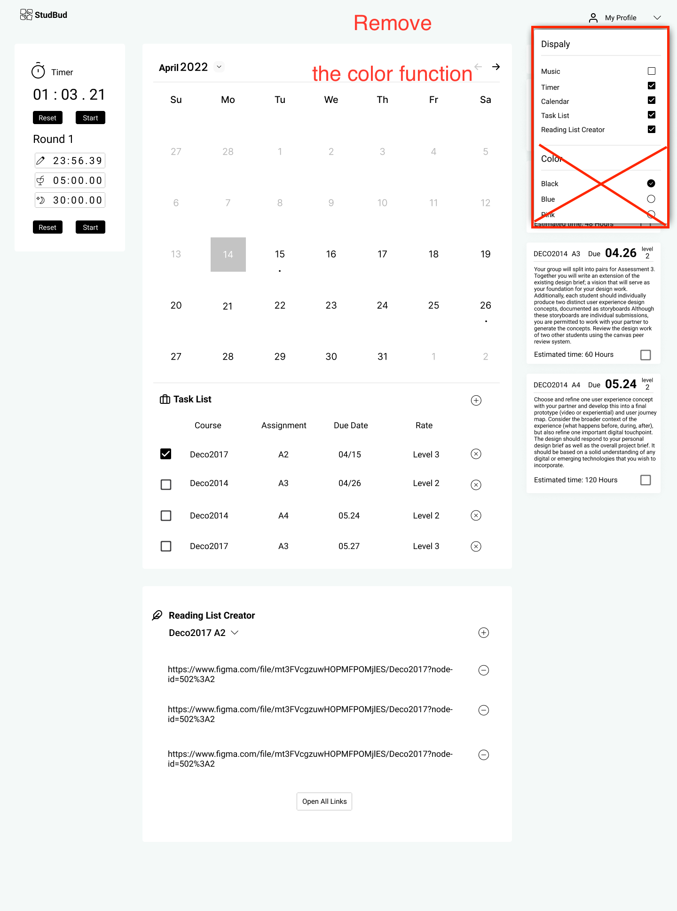
* From feedback change color might ffect the user's concentration, so I canceled this function.
  

# Fianl Web Application
### Music and Timer and Pomodoro

* When the Pomodoro working the work one will be red which can help user to know where they are going. After round 4 will have a long time break.
  

### Calendar
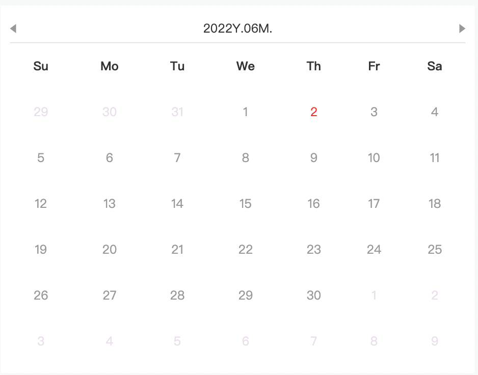
* Nothing change.
* Challange for me is to link the task list.
  

### Reading list
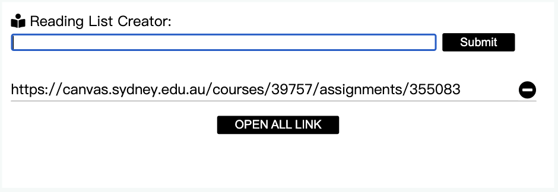
* Give each reading underline that help the user separate the reading.
  

### Task list
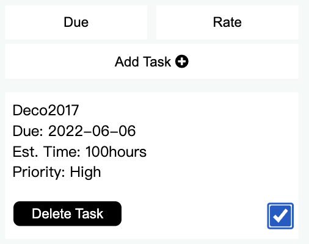
* Make it line to line, which can improve readability.
  

### Setting
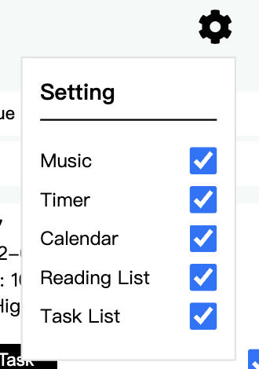
* Change the order to main page order left to right

# Phone version
### Task list
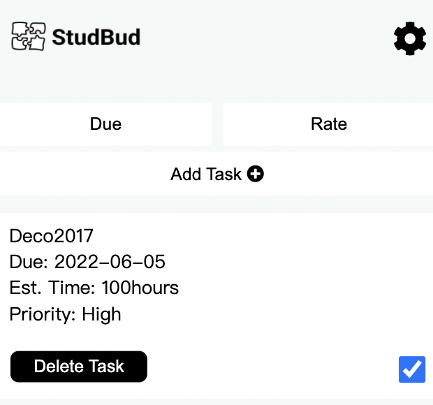
* Change it to the first one in the main page. Because it can help user quickly set the task.
  

### Reading list
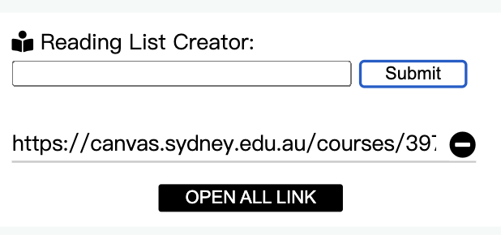
* Give each reading underline that help the user separate the reading.
  

### Music and Timer and Pomodoro
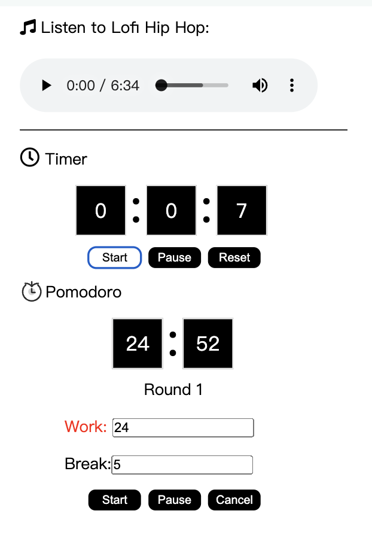
* When the Pomodoro working the work one will be red which can help user to know where they are going. After round 4 will have a long time break.
  

### Setting
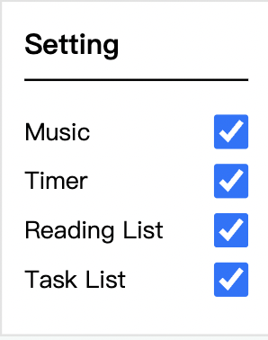
* Remove the Hide calendar function in the setting list.
  

### Reomve Calendar
* Because Calendar will take up a lot of space.
  

## Complete appearance
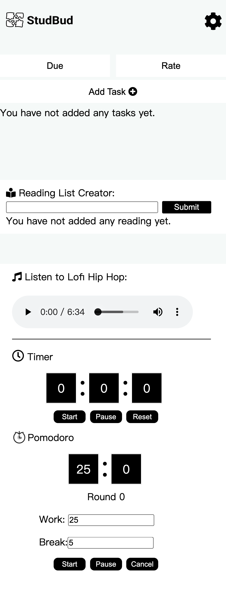

# Final Functional Specification List

| User Goal | Component Name | Functionality | Priority |
| --- | --- | --- | --- |
| Can listen music | Music Player | Click function to play Music | Low |
| Know the usage time | Stopwatch | User can start,puase or cancel the watch | Medium|
| Time planning of the system | Pomodoro | Default 25min work 5min break (4 times) 30 break. User can start,puase or cancel the Pomodoro | Height |
| Can check the day | Calendar| User can see today's date.  | Low |
| Can add the reading sources link | Reading list | User can add or delete the reading link in the reading list| Height |
| Task list can list by due and priority| Task list| User can add tasks to the task list. And can choose the sort method | Height |
| Can hide some function that user won't use | Setting | User can click the selection to control which function will work in the interaction | Medium |
# References

